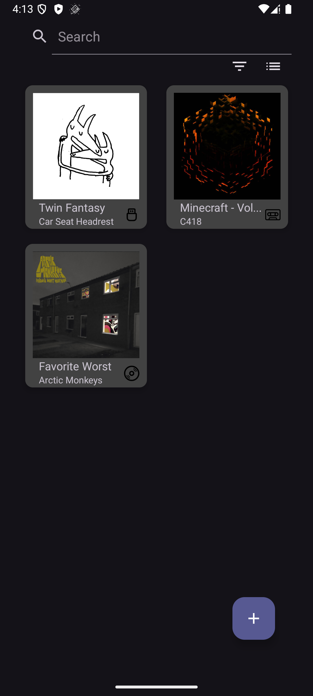
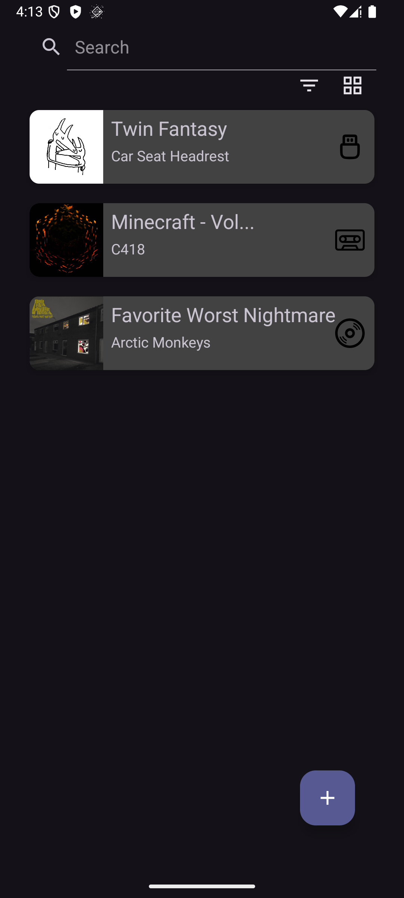
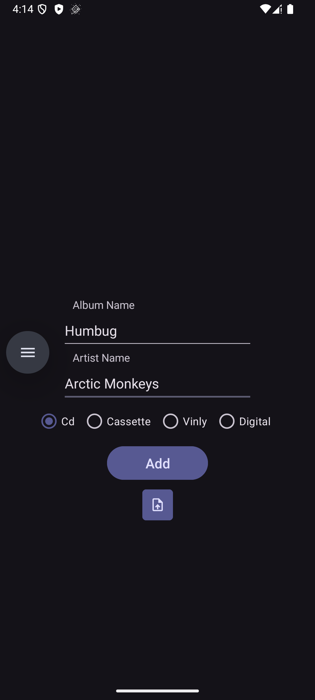
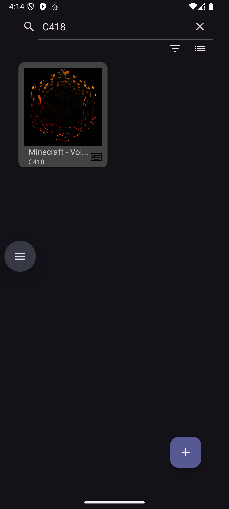
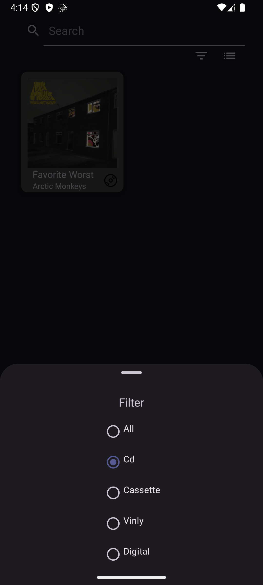

# My Music Collection

A native Android application designed to catalog and manage physical and digital music collections. This repository represents my first comprehensive Android project, built to integrate local databases, external REST APIs, and dynamic list rendering into a complete application.

### Screenshots

  
  
  
  
  

## Features
* **CRUD Operations:** Complete functionality to add, view, edit, and delete music entries.
* **Automated Metadata:** Integrates with the Discogs API to automatically fetch album artwork.
* **Format Categorization:** Tag and filter items by physical or digital medium (CD, Cassette, Vinyl, Digital).
* **Dynamic UI:** Toggle between list and grid view layouts.
* **Search Functionality:** Filter the collection dynamically by album or artist.

## Tech Stack
* **Language:** Java
* **UI Components:** Android SDK, RecyclerView (for scalable list and grid rendering)
* **Local Storage:** Room Database (SQLite)
* **Networking:** Volley (REST API requests)
* **Image Loading:** Picasso

## Architecture & Future Improvements

As my first major Android application, this project prioritized core functionality and learning the Android lifecycle. For future projects, I plan to implement more professional architectural patterns:

* **MVVM Architecture:** Transitioning from Activity-heavy logic to the Model-View-ViewModel pattern to ensure proper separation of concerns.
* **Asynchronous Data I/O:** Replacing main-thread database operations (`.allowMainThreadQueries()`) with background processing using tools like RxJava or Kotlin Coroutines to optimize UI performance.
* **Adapter Optimization:** Consolidating the separate list and grid `RecyclerView` adapters into a single, dynamic adapter to eliminate code duplication.
* **Enhanced Security:** Abstracting hardcoded API keys into a `local.properties` file via `BuildConfig`.
* **Robust Error Handling:** Implementing structured fallback UI states and user feedback mechanisms for network failures and edge cases.
  
And if i decide to update this in the future i plan to add these features:
* Sorting
* Settings page
* Refreshing the main activity after deleting a music.
* Another Cover art provider (e.g. Spotify's API, mostly because discogs doesn't always return a great cover art.)

## Getting Started
1. Clone the repository: `git clone https://github.com/yourusername/my-music-collection.git`
2. Open the project in Android Studio.
3. *Note: Add your Discogs API Key in `AddMusicActivity.java` to enable the auto-fetch cover art feature.*
4. Build and run on an emulator or physical device.
